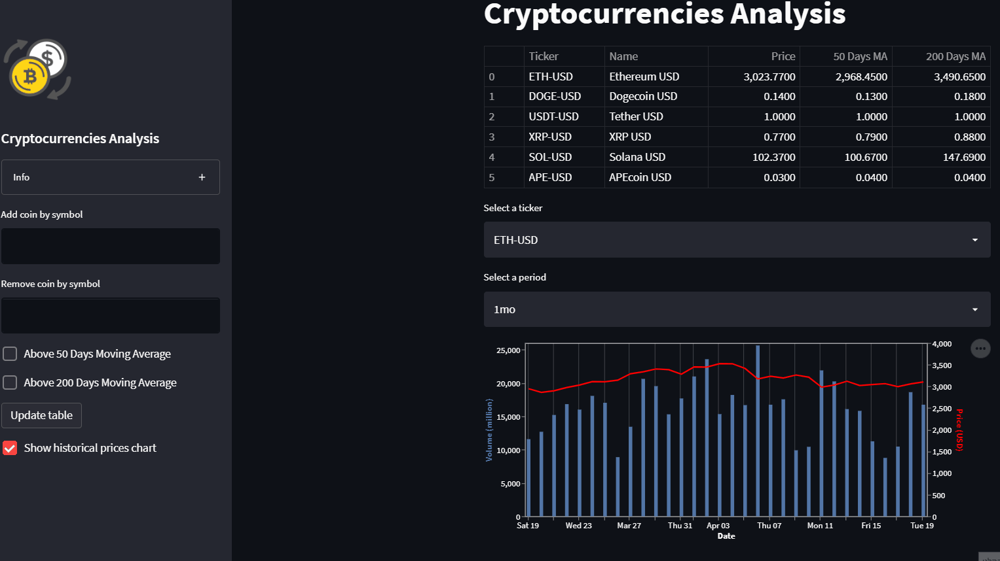

# Cryptocurrencies Analysis (Streamlit + FastAPI)

-   [Description](#description)
-   [Quick start](#quick-start)
-   [Walk through](#walk-through)
    -   [File structure](#file-structure)
    -   [Demo](#Demo)
        
## Description

A streamlit app with FastAPI backend for Crypto screening and analysis. Data is imported from the yfinance library.

## Quick start

Spin it all up

```sh
docker-compose build
```

```sh
docker-compose up -d
```

In your browser, attend [localhost:8501](http://localhost:8501/) and see the Streamlit app alive. Go to [localhost:8000/docs](http://localhost:8000/docs/) to see the documentation for the FastAPI app.

To bring it all down

```sh
docker-compose down --rmi all 
```

## Walk through

### Apps

The repository consist of two apps: FastAPI and Streamlit.

### File structure

```sh
├── README.md
├── docker-compose.yaml
├── backend
│   ├── Dockerfile
│   ├── main.py
│   ├── coins.db
│   ├── database.py
│   ├── models.py
│   └── requirements.txt
└── frontend
    ├── Dockerfile
    ├── streamlit.py
    └── requirements.txt
```

## Demo


